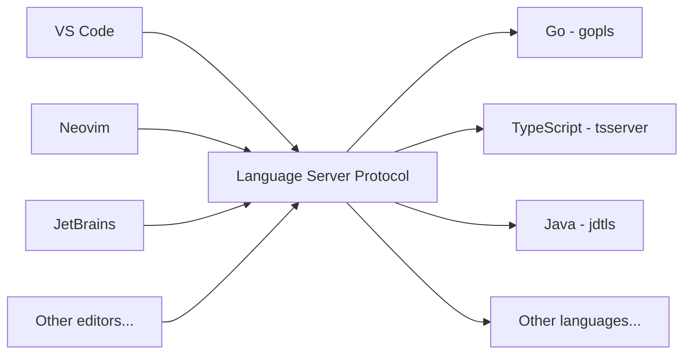
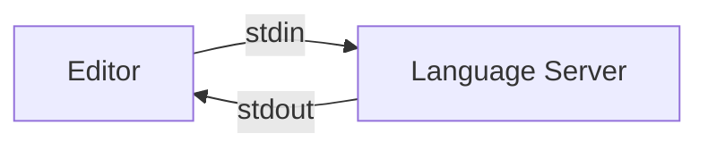
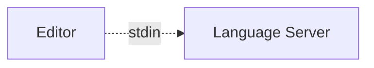
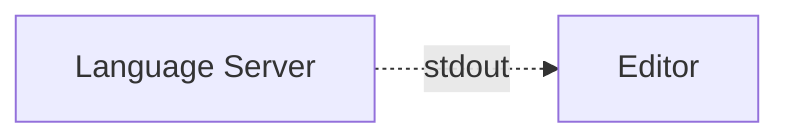
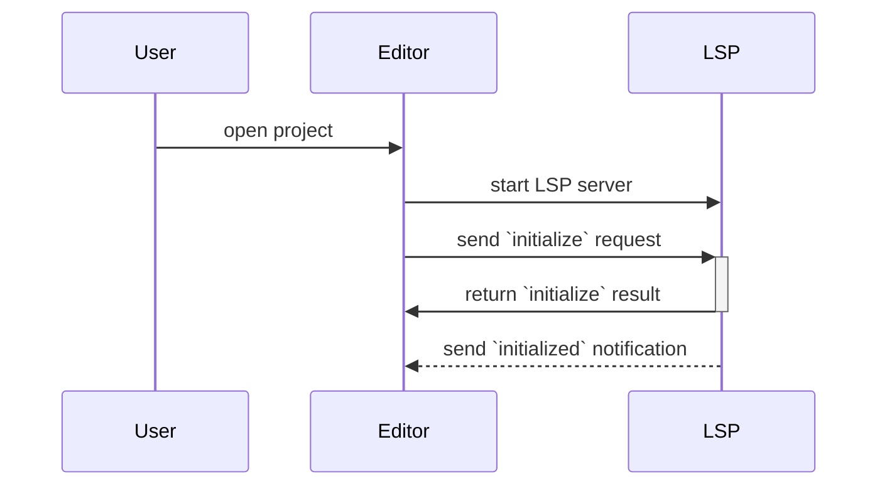
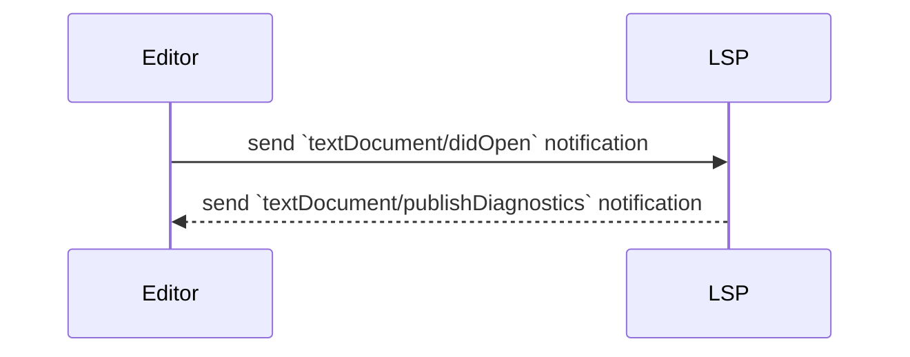
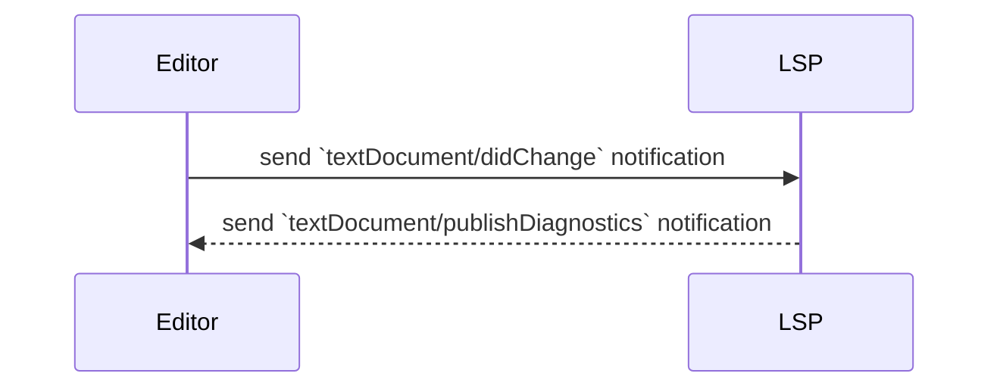

# Understanding Language Server Protocol - autocomplete, formatting

---

# Language Server Protocol (LSP)

> ... defines the protocol used between an editor or IDE and a language server that provides language features like auto complete, go to definition, find all references etc.

https://microsoft.github.io/language-server-protocol/

---

# Autocomplete


---

# Go to definition


---

# Diagnostics


---

# Formatting


---

# One protocol for all languages



---


---
layout: section
---

# Stdin / Stdout

---

# Stdin

```sh
ls /
```

---

# Stdout

```sh
ls /
```

```
Applications System       Volumes      cores        etc          nix          
private      sbin         usr          Library      Users        bin
dev          home         opt          run          tmp          var
```

---

# You can send data to a program over stdin

```sh
echo "I drank a cup of tea." | wc -w
```

```
6
```

---

# The data can be anything

```sh
cat public/diagnostics.gif | shasum -a 256
```

```
f83f8b9706f64f550782d61063e21adca0a79162817dc7fd24686d6dc8a95bc4  -
```

---

# Including structured data

```sh
echo '{ "drankItem": { "name": "Earl Grey", "qty": 1 } }' | jq -r .drankItem
```

```json
{
  "name": "Earl Grey",
  "qty": 1
}
```

---

# `os.Stdin` is an `io.Reader`, `os.Stdout` is an `io.Writer`

```go {0-3|5|6-11|11-13}
func main() {
	count(os.Stdout, os.Stdin)
}

func count(w io.Writer, r io.Reader) {
	scanner := bufio.NewScanner(r)
	scanner.Split(bufio.ScanWords)
	var wc int
	for scanner.Scan() {
		wc++
	}
	msg := fmt.Sprintf("%d words\n", wc)
	w.Write([]byte(msg))
}
```

---

# Message format

```json {1-2|3-16|4-5|6|7-15}
Content-Length: 219\r\n
\r\n
{
	"jsonrpc": "2.0",
	"method": "textDocument/declaration",
	"id": 1,
	"params": {
		"textDocument": {
			"uri": "file:///Users/adrian/project/pizza.cook"
		},
		"position": {
			"line": 10,
			"character": 0
		},
	}
}
```

https://microsoft.github.io/language-server-protocol/specifications/lsp/3.17/specification/#contentPart


---

# LSP clients can send requests that expect a response



---

# LSP clients can send Notifications



---

# 



---

# Initialization



---

# Opening a file



---

# Editing an opened file



---

---
layout: two-cols-header
---

# JSON-RPC

::left::

* Standard for JSON APIs
* Supports methods and notifications
* Both sides can initiate
* Pipelined
   * Receive a notification while waiting for a method response
   * Send a request while receiving a response
* "Transport agnostic"

::right::

```json
{
  "jsonrpc": "2.0",
  "method": "subtract",
  "params": [
    42,
    23
  ],
  "id": 1
}
```

```json
{
  "jsonrpc": "2.0",
  "result": 19,
  "id": 1
}
```

---

# Reading a request

```go
type Request struct {
	ProtocolVersion string           `json:"jsonrpc"`
	ID              *json.RawMessage `json:"id"`
	Method          string           `json:"method"`
	Params          json.RawMessage  `json:"params"`
}

func Read(r *bufio.Reader) (req Request, err error) {
	// Read header.
	header, err := textproto.NewReader(r).ReadMIMEHeader()
	if err != nil {
		return
	}
	contentLength, err := strconv.ParseInt(header.Get("Content-Length"), 10, 64)
	if err != nil {
		return req, ErrInvalidContentLengthHeader
	}
	// Read body.
	err = json.NewDecoder(io.LimitReader(r, contentLength)).Decode(&req)
	return
}
```

<!--

Part of Go's brilliant developer experience is the integration of gopls with text editors like VS Code, Neovim to provide features.
Text editors use the Language Server Protocol standard to communicate.
This standardisation allows multiple text editors to benefit from a single implementation.
In this session, we'll go deeper to find out what's being passed between text editors and the language server, how we can create our own LSPs with Go, and how a project is building on top of the gopls LSP to add autocomplete features to HTML templates.

-->

---
layout: two-cols-header
---

# So, what is it?

::left::

* JSON-RPC messages

> JSON-RPC is a stateless, light-weight remote procedure call (RPC) protocol. Primarily this specification defines several data structures and the rules around their processing. It is transport agnostic in that the concepts can be used within the same process, over sockets, over http, or in many various message passing environments. It uses JSON (RFC 4627) as data format.

> It is designed to be simple!

https://www.jsonrpc.org/specification

::right::

```json
{"jsonrpc": "2.0", "method": "subtract", "params": [42, 23], "id": 1}
```

```json
{"jsonrpc": "2.0", "result": 19, "id": 1}
```

---

# JSON-RPC over stdin/stdout


---

# JSON-RPC batch operations


---

# Starting up the LSP - VS Code

* Make a VS Code extension

---

# Starting up the LSP - Neovim

* Match based on filename / pattern.

---

# Initialize request

* First request sent from the editor to the LSP
* Sets out client capabilities
* Server returns its capabilities

---

# didOpen

> Client support for textDocument/didOpen, textDocument/didChange and textDocument/didClose notifications is mandatory in the protocol and clients can not opt out supporting them. This includes both full and incremental synchronization in the textDocument/didChange notification.

---

# textEdit

				
