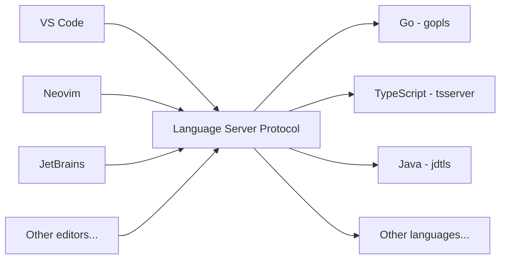
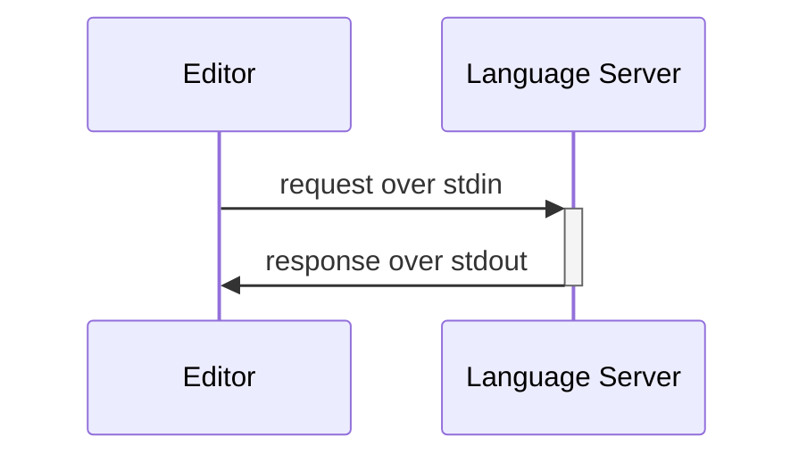
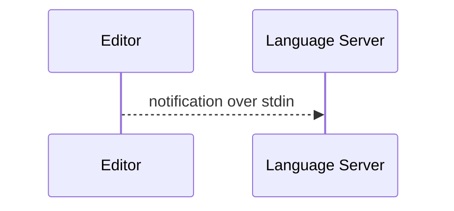
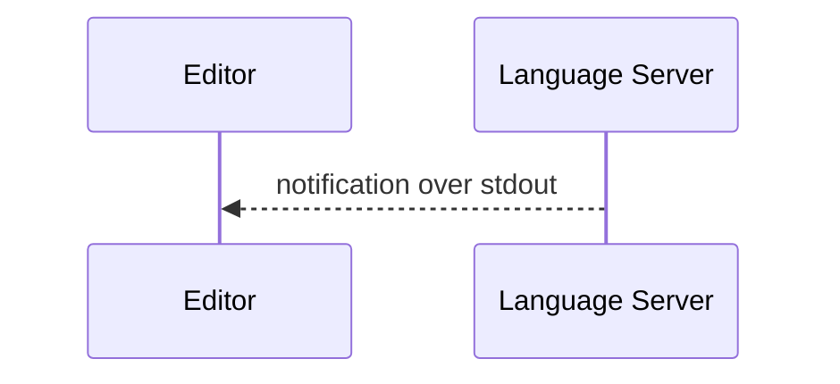
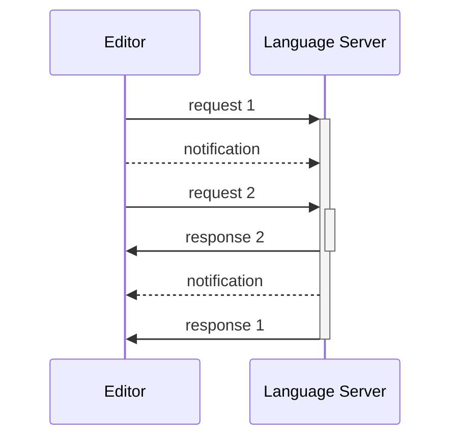
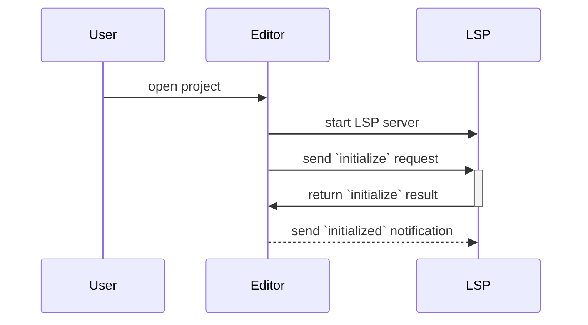
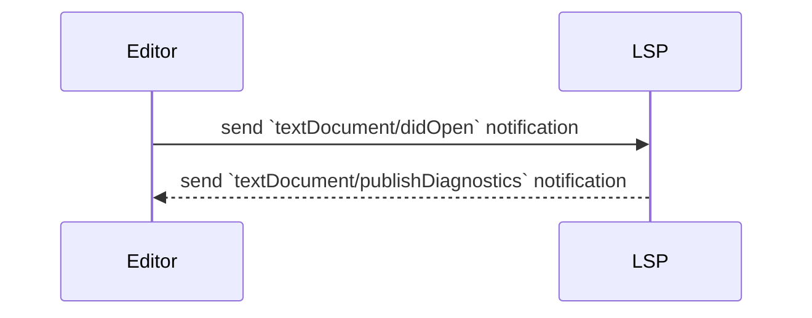
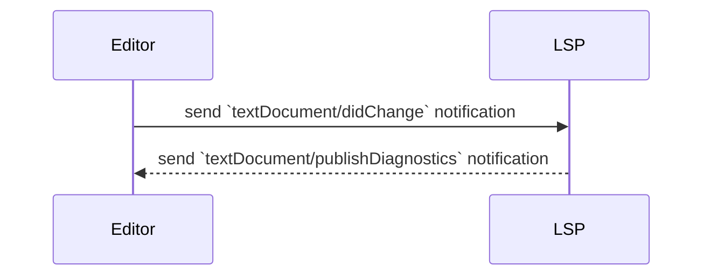

# Understanding Language Server Protocol - autocomplete, formatting

---

# Language Server Protocol (LSP)

> ... defines the protocol used between an editor or IDE and a language server that provides language features like auto complete, go to definition, find all references etc.

https://microsoft.github.io/language-server-protocol/

---

# Autocomplete


---

# Go to definition


---

# Diagnostics


---

# Formatting


---

# One protocol for all languages



---


---
layout: section
---

# Stdin / Stdout

---

# Stdin

```sh
ls /
```

---

# Stdout

```sh
ls /
```

```
Applications System       Volumes      cores        etc          nix          
private      sbin         usr          Library      Users        bin
dev          home         opt          run          tmp          var
```

---

# You can send data to a program over stdin

```sh
echo "I drank a cup of tea." | wc -w
```

```
6
```

---

# The data can be anything

```sh
cat public/diagnostics.gif | shasum -a 256
```

```
f83f8b9706f64f550782d61063e21adca0a79162817dc7fd24686d6dc8a95bc4  -
```

---

# Including structured data

```sh
echo '{ "drankItem": { "name": "Earl Grey", "qty": 1 } }' | jq
```

```json
{
  "drankItem": {
    "name": "Earl Grey",
    "qty": 1
  }
}
```

---

# `os.Stdin` is an `io.Reader`, `os.Stdout` is an `io.Writer`

```go {0-3|5|6-10|11-13}
func main() {
	formatJSON(os.Stdout, os.Stdin)
}

func formatJSON(w io.Writer, r io.Reader) (err error) {
	var m map[string]any
	err = json.NewDecoder(r).Decode(&m)
	if err != nil {
		return
	}
	enc := json.NewEncoder(w)
	enc.SetIndent("", "	")
	return enc.Encode(m)
}
```

---
layout: section
---

# LSP Message Format

---

# LSP clients can send requests that expect a response



---

# Request messages have header and content parts

```json {1-2|3-16|4-5|6|7-15}
Content-Length: 219\r\n
\r\n
{
	"jsonrpc": "2.0",
	"method": "textDocument/declaration",
	"id": 1,
	"params": {
		"textDocument": {
			"uri": "file:///Users/adrian/project/pizza.cook"
		},
		"position": {
			"line": 10,
			"character": 0
		},
	}
}
```

https://microsoft.github.io/language-server-protocol/specifications/lsp/3.17/specification/#contentPart

---

# Response messages are linked to the request by the ID

```json {1-2|4|5|6-14}
Content-Length: 222\r\n
\r\n
{
	"jsonrpc": "2.0",
	"id": 1,
	"result": [
		{
			"uri": "file:///Users/adrian/project/pizza.cook",
			"range": {
			    "start": { "line": 5, "character": 23 },
			    "end" : { "line": 6, "character": 0 }
			},
		}
	]
}
```
---

# Editors can send notifications to the server




---

# Servers can send notifications to the editor



---

# Notifications are the same as requests, but without an ID

TODO: Update this to be a realistic notification

```json {1-2|3-16|4-5|6|7-15}
Content-Length: 219\r\n
\r\n
{
	"jsonrpc": "2.0",
	"method": "textDocument/declaration",
	"params": {
		"textDocument": {
			"uri": "file:///Users/adrian/project/pizza.cook"
		},
		"position": {
			"line": 10,
			"character": 0
		},
	}
}
```

---

# Messages are interleaved



---
layout: two-cols-header
---

# Request messages are defined as TypeScript interfaces

```ts {|6,8,13}
interface Message {
	jsonrpc: string;
}

interface RequestMessage extends Message {
	id: integer | string;
	method: string;
	params?: array | object;
}

interface NotificationMessage extends Message {
	method: string;
	params?: array | object;
}
```

---

# We can use `json.RawMessage` to defer processing

```go
type Message interface {
  IsJSONRPC() bool
}

type Request struct {
  Version string           `json:"jsonrpc"`
  ID      *json.RawMessage `json:"id"`
  Method  string           `json:"method"`
  Params  json.RawMessage  `json:"params"`
}

func (r Request) IsJSONRPC() bool {
  return r.Version == "2.0"
}

func (r Request) IsNotification() bool {
	return r.ID == nil
}
```

---

# Reading a message

```go {|2-5|6-9|10-13|14-16}
func Read(r *bufio.Reader) (req Request, err error) {
	header, err := textproto.NewReader(r).ReadMIMEHeader()
	if err != nil {
		return
	}
	contentLength, err := strconv.ParseInt(header.Get("Content-Length"), 10, 64)
	if err != nil {
		return req, ErrInvalidContentLengthHeader
	}
	err = json.NewDecoder(io.LimitReader(r, contentLength)).Decode(&req)
	if err != nil {
		return
	}
	if !req.IsJSONRPC() {
		return req, ErrInvalidRequest
	}
	return
}
```

---

# Response messages are defined as TypeScript interfaces

```ts
interface ResponseMessage extends Message {
	id: integer | string | null;
	result?: string | number | boolean | array | object | null;
	error?: ResponseError;
}

interface ResponseError {
	code: integer;
	message: string;
	data?: string | number | boolean | array | object | null;
}
```

---

# In Go, TypeScript unions are reduced to `any`

```go
type Response struct {
	ProtocolVersion string           `json:"jsonrpc"`
	ID              *json.RawMessage `json:"id"`
	Result          any              `json:"result"`
	Error           *Error           `json:"error"`
}

func (r Response) IsJSONRPC() bool { return r.ProtocolVersion == "2.0" }

type Error struct {
	Code int64 `json:"code"`
	Message string `json:"message"`
	Data any `json:"data"`
}

func (e *Error) Error() string { return e.Message }
```

---

# Sending a notification or response message

```go {|2-5|6-9|10-12|13}
func Write(w *bufio.Writer, msg Message) (err error) {
	body, err := json.Marshal(msg)
	if err != nil {
		return
	}
	headers := fmt.Sprintf("Content-Length: %d\r\n\r\n", len(body))
	if _, err = w.WriteString(headers); err != nil {
		return
	}
	if _, err = w.Write(body); err != nil {
		return
	}
	return w.Flush()
}
```

---
layout: section
---

# Joining it all together

---

# Define handlers

```go
type NotificationHandler func(params json.RawMessage) (err error)
type MethodHandler func(params json.RawMessage) (result any, err error)

type Transport struct {
	reader               *bufio.Reader
	writer               *bufio.Writer
	notificationHandlers map[string]NotificationHandler
	methodHandlers       map[string]MethodHandler
}

func (t *Transport) HandleMethod(name string, method MethodHandler) {
	t.methodHandlers[name] = method
}

func (t *Transport) HandleNotification(name string, notification NotificationHandler) {
	t.notificationHandlers[name] = notification
}
```

---

# Process messages

```go
func (t *Transport) Process() (err error) {
	req, err := Read(t.reader)
	if err != nil { return err }
	if req.IsNotification() {
		if nh, ok := t.notificationHandlers[req.Method]; ok {
			return nh(req.Params)
		}
	} else {
		mh, ok := t.methodHandlers[req.Method]
		if !ok {
			return Write(t.writer, NewResponseError(req.ID, ErrMethodNotFound))
		}
		result, err := mh(req.Params)
		if err != nil {
			return Write(t.writer, NewResponseError(req.ID, err))
		}
		return Write(t.writer, NewResponse(req.ID, result))
	}
}
```

---
layout: section
---

# Summary

---

# Summary

* LSP messages are sent over stdin/stdout
* Messages consist of MIME headers, followed by a JSON RPC body
* Mesages can be requests/responses correlated by ID, or notifications which don't need a response
* The text editor doesn't need to wait for a response to a request to send additional requests
* The LSP _or_ text editor can send notifications, such as `textDocument/didOpen` or `textDocument/publishDiagnostics`
* Our new `Transport` type can be used to register notification and request/response handler functions

---
layout: section
---

# Initialization

---

# Sequence



---

# `initialize` - TypeScript

```typescript
interface InitializeParams extends WorkDoneProgressParams {
	processId: integer | null;
	clientInfo?: {
		name: string;
		version?: string;
	};
	locale?: string;
	initializationOptions?: LSPAny;
	capabilities: ClientCapabilities;
	trace?: TraceValue;
	workspaceFolders?: WorkspaceFolder[] | null;
}
```

---

# `ClientCapabilities`

```typescript
interface ClientCapabilities {
	workspace?: {
		applyEdit?: boolean;
		workspaceEdit?: WorkspaceEditClientCapabilities;
		didChangeConfiguration?: DidChangeConfigurationClientCapabilities;
		didChangeWatchedFiles?: DidChangeWatchedFilesClientCapabilities;
		inlineValue?: InlineValueWorkspaceClientCapabilities;
		// ...
		inlayHint?: InlayHintWorkspaceClientCapabilities;
		diagnostics?: DiagnosticWorkspaceClientCapabilities;
	};
	// ...
	window?: {
		workDoneProgress?: boolean;
		showMessage?: ShowMessageRequestClientCapabilities;
		showDocument?: ShowDocumentClientCapabilities;
	};

	// ...
	experimental?: LSPAny;
}
```

---

# `InitializeParams` - Go

```go
type InitializeParams struct {
	// Information about the client
	ClientInfo *ClientInfo `json:"clientInfo"`

	// The capabilities provided by the client (editor or tool)
	Capabilities ClientCapabilities `json:"capabilities"`
}

type ClientInfo struct {
	Name    string  `json:"name"`
	Version *string `json:"version"`
}

type ClientCapabilities struct {
}
```

---

# `ServerCapabilities` - TypeScript

```typescript
interface ServerCapabilities {
	positionEncoding?: PositionEncodingKind;
	// ...
	completionProvider?: CompletionOptions;
	hoverProvider?: boolean | HoverOptions;
	signatureHelpProvider?: SignatureHelpOptions;
	declarationProvider?: boolean | DeclarationOptions | DeclarationRegistrationOptions;
	definitionProvider?: boolean | DefinitionOptions;
	typeDefinitionProvider?: boolean | TypeDefinitionOptions | TypeDefinitionRegistrationOptions;
	implementationProvider?: boolean | ImplementationOptions | ImplementationRegistrationOptions;
	referencesProvider?: boolean | ReferenceOptions;
	// ...
	documentFormattingProvider?: boolean | DocumentFormattingOptions;
	// ...
	renameProvider?: boolean | RenameOptions;
	// ...
	diagnosticProvider?: DiagnosticOptions | DiagnosticRegistrationOptions;
	// ...
	experimental?: LSPAny;
}
```

---

# `ServerCapabilities` - Go

```go
type ServerCapabilities struct {
	TextDocumentSync TextDocumentSyncKind `json:"textDocumentSync"`
}

type TextDocumentSyncKind int

const (
	TextDocumentSyncKindNone TextDocumentSyncKind = iota
	TextDocumentSyncKindFull
	TextDocumentSyncKindIncremental
)
```

---

# `initialize` Handler

```go
func main() {
	p := protocol.New(os.Stdin, os.Stdout)
	p.HandleMethod("initialize", func(params json.RawMessage) (result any, err error) {
		var initializeParams messages.InitializeParams
		if err = json.Unmarshal(params, &initializeParams); err != nil {
			return result, err
		}
		result = messages.InitializeResult{
			Capabilities: messages.ServerCapabilities{
				TextDocumentSync: messages.TextDocumentSyncKindFull,
			},
			ServerInfo: &messages.ServerInfo{ Name: "examplelsp" },
		}
		return result, err
	})
	for {
		if err := p.Process(); err != nil {
			return
		}
	}
}
```

---

# `initialized` notification handler

```go
p.HandleNotification("initialized", func(params json.RawMessage) (err error) {
	go func() {
		count := 1
		for {
			time.Sleep(time.Second * 1)
			p.Notify(messages.ShowMessageMethod, messages.ShowMessageParams{
				Type:    messages.MessageTypeInfo,
				Message: fmt.Sprintf("Shown %d messages", count),
			})
			count++
		}
	}()
	return nil
})
```

---

# Sending notifications to the text editor

```go
type Notification struct {
	ProtocolVersion string `json:"jsonrpc"`
	Method          string `json:"method"`
	Params          any    `json:"params"`
}

func (n Notification) IsJSONRPC() bool {
	return n.ProtocolVersion == "2.0"
}
```

```go
func (t *Transport) Notify(method string, params any) (err error) {
	n := Notification{
		ProtocolVersion: "2.0",
		Method:          method,
		Params:          params,
	}
	return Write(t.writer, n)
}
```

---
layout: section
---

# Summary - initialization

---

# Summary - initialization

* The text editor sends an `initialize` request that explains its capabilities.
* The LSP returns a response that states its capabilities.
* After the `initialize` request/response, the text editor sends an `initialized` notification.
* Before using a capability, the LSP _should_ check to see if the text editor supports it.
* The LSP can start sending notifications to the client with the `Notify` method.
* The most basic LSP could simply remind you to take a break by sending you a notification.

---
layout: section
---

# Using our new LSP

---

# Using our new LSP - Neovim

## init.lua

```lua
vim.api.nvim_create_autocmd('FileType', {
  pattern = 'cook',
  callback = function()
    vim.lsp.start({
      name = "examplelsp",
      cmd = { "examplelsp" },
      root_dir = vim.fs.dirname(vim.fs.find({ ".examplelsp" }, { upward = true })[1]),
    })
  end,
})
```

## startup.sh

```sh
nvim --clean -u ./neovim-config/init.lua pizza.cook
```

---

## Notifications result


---

# Opening a file



---

# Editing an opened file



---

<!--

Part of Go's brilliant developer experience is the integration of gopls with text editors like VS Code, Neovim to provide features.
Text editors use the Language Server Protocol standard to communicate.
This standardisation allows multiple text editors to benefit from a single implementation.
In this session, we'll go deeper to find out what's being passed between text editors and the language server, how we can create our own LSPs with Go, and how a project is building on top of the gopls LSP to add autocomplete features to HTML templates.

-->

