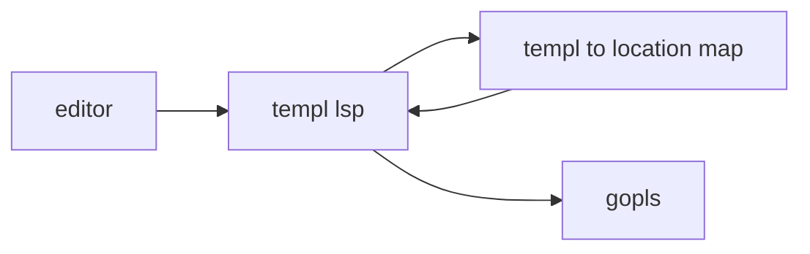

# Understanding Language Server Protocol - autocomplete, formatting

---

# Topics

* What is LSP?
* LSP message formats
* Initialization handshake
* Request/response handling
* Notification handling
* Using your LSP in an editor
* Debugging

---
layout: two-cols
---

# Language Server Protocol
## LSP

<br>

> ... defines the protocol used between an editor or IDE and a language server that provides language features like auto complete, go to definition, find all references etc.

https://microsoft.github.io/language-server-protocol/

::right::


---

# Autocomplete


---

# Go to definition


---

# Diagnostics


---

# Formatting


---

# One protocol for all languages


---
layout: section
---

# Stdin / Stdout

---

# Stdin

```sh
ls /
```

---

# Stdout

```sh
ls /
```

```
Applications System       Volumes      cores        etc          nix          
private      sbin         usr          Library      Users        bin
dev          home         opt          run          tmp          var
```

---

# You can send data to a program over stdin

```sh
echo "I drank a cup of tea." | wc -w
```

```
6
```

---

# The data can be anything

```sh
cat public/diagnostics.gif | shasum -a 256
```

```
f83f8b9706f64f550782d61063e21adca0a79162817dc7fd24686d6dc8a95bc4  -
```

---

# Including structured data

```sh
echo '{ "drankItem": { "name": "Earl Grey", "qty": 1 } }' | jq
```

```json
{
  "drankItem": {
    "name": "Earl Grey",
    "qty": 1
  }
}
```

---

# `os.Stdin` is an `io.Reader`, `os.Stdout` is an `io.Writer`

```go {0-3|5|6-10|11-13}
func main() {
	formatJSON(os.Stdout, os.Stdin)
}

func formatJSON(w io.Writer, r io.Reader) (err error) {
	var m map[string]any
	err = json.NewDecoder(r).Decode(&m)
	if err != nil {
		return
	}
	enc := json.NewEncoder(w)
	enc.SetIndent("", "	")
	return enc.Encode(m)
}
```

---
layout: section
---

# LSP Message Format

---

# Editors can send requests that require a response


---

# Request messages have header and content parts

```json {1-2|3-16|4-5|6|7-15}
Content-Length: 219\r\n
\r\n
{
	"jsonrpc": "2.0",
	"method": "textDocument/declaration",
	"id": 1,
	"params": {
		"textDocument": {
			"uri": "file:///Users/adrian/project/pizza.cook"
		},
		"position": {
			"line": 10,
			"character": 0
		},
	}
}
```

https://microsoft.github.io/language-server-protocol/specifications/lsp/3.17/specification/#contentPart

---

# Response messages are linked to the request by the ID

```json {1-2|4|5|6-14}
Content-Length: 222\r\n
\r\n
{
	"jsonrpc": "2.0",
	"id": 1,
	"result": [
		{
			"uri": "file:///Users/adrian/project/pizza.cook",
			"range": {
			    "start": { "line": 5, "character": 23 },
			    "end" : { "line": 6, "character": 0 }
			},
		}
	]
}
```
---

# Editors can send notifications to the server


---

# Servers can send notifications to the editor


---

# Notifications are the same as requests, but without an ID

```json {1-2|3-16|4-5|6-13}
Content-Length: 320\r\n
\r\n
{
  "jsonrpc": "2.0",
  "method": "textDocument/didOpen",
  "params": {
    "textDocument": {
      "text": "the full text of the document you just opened",
      "version": 0,
      "languageId": "cook",
      "uri": "file:///Users/adrian/github.com/a-h/examplelsp/example-project/pizza.cook"
    }
  }
}
```

---

# Messages are interleaved


---
layout: two-cols-header
---

# Request messages are defined as TypeScript interfaces

```ts {|6,8,13}
interface Message {
	jsonrpc: string;
}

interface RequestMessage extends Message {
	id: integer | string;
	method: string;
	params?: array | object;
}

interface NotificationMessage extends Message {
	method: string;
	params?: array | object;
}
```

---

# We can use `json.RawMessage` to defer processing

```go
type Message interface {
  IsJSONRPC() bool
}

type Request struct {
  Version string           `json:"jsonrpc"`
  ID      *json.RawMessage `json:"id"`
  Method  string           `json:"method"`
  Params  json.RawMessage  `json:"params"`
}

func (r Request) IsJSONRPC() bool {
  return r.Version == "2.0"
}

func (r Request) IsNotification() bool {
	return r.ID == nil
}
```

---

# Reading a message

```go {|2-5|6-9|10-13|14-16}
func Read(r *bufio.Reader) (req Request, err error) {
	header, err := textproto.NewReader(r).ReadMIMEHeader()
	if err != nil {
		return
	}
	contentLength, err := strconv.ParseInt(header.Get("Content-Length"), 10, 64)
	if err != nil {
		return req, ErrInvalidContentLengthHeader
	}
	err = json.NewDecoder(io.LimitReader(r, contentLength)).Decode(&req)
	if err != nil {
		return
	}
	if !req.IsJSONRPC() {
		return req, ErrInvalidRequest
	}
	return
}
```

---

# Response messages are defined as TypeScript interfaces

```ts {|3,10}
interface ResponseMessage extends Message {
	id: integer | string | null;
	result?: string | number | boolean | array | object | null;
	error?: ResponseError;
}

interface ResponseError {
	code: integer;
	message: string;
	data?: string | number | boolean | array | object | null;
}
```

---

# In Go, TypeScript unions are reduced to `any`

```go {|4,13}
type Response struct {
	ProtocolVersion string           `json:"jsonrpc"`
	ID              *json.RawMessage `json:"id"`
	Result          any              `json:"result"`
	Error           *Error           `json:"error"`
}

func (r Response) IsJSONRPC() bool { return r.ProtocolVersion == "2.0" }

type Error struct {
	Code    int64 `json:"code"`
	Message string `json:"message"`
	Data    any `json:"data"`
}

func (e *Error) Error() string { return e.Message }
```

---

# And we don't need to process the ID at all

```go {3}
type Response struct {
	ProtocolVersion string           `json:"jsonrpc"`
	ID              *json.RawMessage `json:"id"`
	Result          any              `json:"result"`
	Error           *Error           `json:"error"`
}

func (r Response) IsJSONRPC() bool { return r.ProtocolVersion == "2.0" }

type Error struct {
	Code    int64 `json:"code"`
	Message string `json:"message"`
	Data    any `json:"data"`
}

func (e *Error) Error() string { return e.Message }
```

---

# Sending a notification or response message

```go {|2-5|6-9|10-12|13}
func Write(w *bufio.Writer, msg Message) (err error) {
	body, err := json.Marshal(msg)
	if err != nil {
		return
	}
	headers := fmt.Sprintf("Content-Length: %d\r\n\r\n", len(body))
	if _, err = w.WriteString(headers); err != nil {
		return
	}
	if _, err = w.Write(body); err != nil {
		return
	}
	return w.Flush()
}
```

---
layout: section
---

# Joining it all together

---

# Define handlers

```go {|5-6|1-2|1|2|7-8,12-18}
type NotificationHandler func(params json.RawMessage) (err error)
type MethodHandler func(params json.RawMessage) (result any, err error)

type Mux struct {
	reader               *bufio.Reader
	writer               *bufio.Writer
	notificationHandlers map[string]NotificationHandler
	methodHandlers       map[string]MethodHandler
	writeLock            *sync.Mutex
}

func (m *Mux) HandleMethod(name string, method MethodHandler) {
	m.methodHandlers[name] = method
}

func (m *Mux) HandleNotification(name string, notification NotificationHandler) {
	m.notificationHandlers[name] = notification
}

```

---

# Send notifications to the text editor

```go {|3|6-10|11-}
type Mux struct {
	// ...
	writeLock *sync.Mutex
}

func (m *Mux) write(msg Message) (err error) {
	m.writeLock.Lock()
	defer m.writeLock.Unlock()
	return Write(m.writer, msg)
}

func (m *Mux) Notify(method string, params any) (err error) {
	n := Notification{
		ProtocolVersion: "2.0",
		Method:          method,
		Params:          params,
	}
	return m.write(n)
}
```

---

# What might happen without a mutex?


---

# With a mutex?


---

# Process messages

```go {|2|4|5-7|9|10-12|13-17}
func (m *Mux) Process() (err error) {
	req, err := Read(m.reader)
	if err != nil { return err }
	if req.IsNotification() {
		if nh, ok := m.notificationHandlers[req.Method]; ok {
			return nh(req.Params)
		}
	} else {
		mh, ok := m.methodHandlers[req.Method]
		if !ok {
			return m.write(NewResponseError(req.ID, ErrMethodNotFound))
		}
		result, err := mh(req.Params)
		if err != nil {
			return m.write(NewResponseError(req.ID, err))
		}
		return m.write(NewResponse(req.ID, result))
	}
}
```


---
layout: section
---

# Summary

---

# Summary

* LSP messages are sent over stdin/stdout
* Messages consist of MIME headers, followed by a JSON RPC body
* Mesages can be requests/responses correlated by ID, or notifications which don't need a response
* The text editor doesn't need to wait for a response to a request to send additional requests
* The LSP _or_ text editor can send notifications, such as `textDocument/didOpen` or `textDocument/publishDiagnostics`
* Our new `Mux` type can be used to register notification and request/response handler functions

---
layout: section
---

# Initialization

---

# Sequence


---

# `initialize` - TypeScript

```typescript
interface InitializeParams extends WorkDoneProgressParams {
	processId: integer | null;
	clientInfo?: {
		name: string;
		version?: string;
	};
	locale?: string;
	initializationOptions?: LSPAny;
	capabilities: ClientCapabilities;
	trace?: TraceValue;
	workspaceFolders?: WorkspaceFolder[] | null;
}
```

---

# `ClientCapabilities`

```typescript
interface ClientCapabilities {
	workspace?: {
		applyEdit?: boolean;
		workspaceEdit?: WorkspaceEditClientCapabilities;
		didChangeConfiguration?: DidChangeConfigurationClientCapabilities;
		didChangeWatchedFiles?: DidChangeWatchedFilesClientCapabilities;
		inlineValue?: InlineValueWorkspaceClientCapabilities;
		// ...
		inlayHint?: InlayHintWorkspaceClientCapabilities;
		diagnostics?: DiagnosticWorkspaceClientCapabilities;
	};
	// ...
	window?: {
		workDoneProgress?: boolean;
		showMessage?: ShowMessageRequestClientCapabilities;
		showDocument?: ShowDocumentClientCapabilities;
	};

	// ...
	experimental?: LSPAny;
}
```

---

# `InitializeParams` - Go

```go
type InitializeParams struct {
	// Information about the client
	ClientInfo *ClientInfo `json:"clientInfo"`

	// The capabilities provided by the client (editor or tool)
	Capabilities ClientCapabilities `json:"capabilities"`
}

type ClientInfo struct {
	Name    string  `json:"name"`
	Version *string `json:"version"`
}

type ClientCapabilities struct {
}
```

---

# `ServerCapabilities` - TypeScript

```typescript
interface ServerCapabilities {
	positionEncoding?: PositionEncodingKind;
	// ...
	completionProvider?: CompletionOptions;
	hoverProvider?: boolean | HoverOptions;
	signatureHelpProvider?: SignatureHelpOptions;
	declarationProvider?: boolean | DeclarationOptions | DeclarationRegistrationOptions;
	definitionProvider?: boolean | DefinitionOptions;
	typeDefinitionProvider?: boolean | TypeDefinitionOptions | TypeDefinitionRegistrationOptions;
	implementationProvider?: boolean | ImplementationOptions | ImplementationRegistrationOptions;
	referencesProvider?: boolean | ReferenceOptions;
	// ...
	documentFormattingProvider?: boolean | DocumentFormattingOptions;
	// ...
	renameProvider?: boolean | RenameOptions;
	// ...
	diagnosticProvider?: DiagnosticOptions | DiagnosticRegistrationOptions;
	// ...
	experimental?: LSPAny;
}
```

---

# `ServerCapabilities` - Go

```go
type ServerCapabilities struct {
	TextDocumentSync TextDocumentSyncKind `json:"textDocumentSync"`
}

type TextDocumentSyncKind int

const (
	TextDocumentSyncKindNone TextDocumentSyncKind = iota
	TextDocumentSyncKindFull
	TextDocumentSyncKindIncremental
)
```

---

# `initialize` Handler

```go {|2|3,15|4-7|8-14|16-20}
func main() {
	m := lsp.NewMux(os.Stdin, os.Stdout)
	m.HandleMethod("initialize", func(params json.RawMessage) (result any, err error) {
		var initializeParams messages.InitializeParams
		if err = json.Unmarshal(params, &initializeParams); err != nil {
			return result, err
		}
		result = messages.InitializeResult{
			Capabilities: messages.ServerCapabilities{
				TextDocumentSync: messages.TextDocumentSyncKindFull,
			},
			ServerInfo: &messages.ServerInfo{ Name: "examplelsp" },
		}
		return result, err
	})
	for {
		if err := m.Process(); err != nil {
			return
		}
	}
}
```

---

# `initialized` notification handler

```go
m.HandleNotification("initialized", func(params json.RawMessage) (err error) {
	// Do something interesting.
})
```

---

# "Hello, World"

```go {2-12}
m.HandleNotification("initialized", func(params json.RawMessage) (err error) {
	go func() {
		count := 1
		for {
			time.Sleep(time.Second * 1)
			m.Notify("window/showMessage", messages.ShowMessageParams{
				Type:    messages.MessageTypeInfo,
				Message: fmt.Sprintf("Shown %d messages", count),
			})
			count++
		}
	}()
	return nil
})
```

---
layout: section
---

# Summary - initialization

---

# Summary - initialization

* The text editor sends an `initialize` request that explains its capabilities.
* The LSP returns a response that states its capabilities.
* After the `initialize` request/response, the text editor sends an `initialized` notification.
* Before using a capability, the LSP _should_ check to see if the text editor supports it.
* The LSP can start sending notifications to the client with the `Notify` method.
* Sending a `window/showMessage` notification is the "Hello, World" of LSP.

---
layout: section
---

# Running our LSP in an editor

---

# Neovim

## init.lua

```lua
vim.api.nvim_create_autocmd('FileType', {
  pattern = 'cook',
  callback = function()
    vim.lsp.start({
      name = "examplelsp",
      cmd = { "examplelsp" },
      root_dir = vim.fs.dirname(vim.fs.find({ ".examplelsp" }, { upward = true })[1]),
    })
  end,
})
```

## startup.sh

```sh
nvim --clean -u ./neovim-config/init.lua pizza.cook
```

---

## Notifications result


---

# Visual Studio Code - `extension.ts`

```typescript {|7|8|11|13-14}
import { LanguageClient, LanguageClientOptions, ServerOptions, TransportKind } from "vscode-languageclient/node";

let client: LanguageClient;

export function activate(context: vscode.ExtensionContext) {
  const serverOptions: ServerOptions = {
	command: "examplelsp",
	transport: TransportKind.stdio,
  };
  const clientOptions: LanguageClientOptions = {
    documentSelector: [{ scheme: "file", language: "cook" }],
  };
  client = new LanguageClient("cook", "cook", serverOptions, clientOptions);
  client.start();
}

export function deactivate(): Thenable<void> | undefined {
  if (!client) { return undefined; }
  return client.stop();
}
```

---

# Visual Studio Code - `package.json`

```json {|4-7|9-15|17-19}
{
  "name": "vscode-cooklang",
  // ...
  "activationEvents": [
    "workspaceContains:**/*.cook",
    "onLanguage:cook"
  ],
  // ...
  "contributes": {
    "languages": [{
      "id": "cook",
      "aliases": ["cook"],
      "extensions": [".cook", ".cooklang"]
    }]
  },
  // ...
  "dependencies": {
    "vscode-languageclient": "^8.1.0"
  }
}
```

---

# Visual Studio Code - debugging


---

# JetBrains IDEs

* Build a JetBrains Plugin, using Java
* https://blog.jetbrains.com/platform/2023/07/lsp-for-plugin-developers/

<br>

```java
import com.intellij.platform.lsp.api.LspServerSupportProvider
import com.intellij.platform.lsp.api.ProjectWideLspServerDescriptor

class FooLspServerSupportProvider : LspServerSupportProvider {
   override fun fileOpened(project: Project, file: VirtualFile, serverStarter: LspServerStarter) {
       if (file.extension == "foo") {
           serverStarter.ensureServerStarted(FooLspServerDescriptor(project))
       }
   }
}

private class FooLspServerDescriptor(project: Project) : ProjectWideLspServerDescriptor(project, "Foo") {
   override fun isSupportedFile(file: VirtualFile) = file.extension == "foo"
   override fun createCommandLine() = GeneralCommandLine("foo", "--stdio")
}
```

---
layout: section
---

# Build an LSP for cooklang

---

# cooklang

## Recipe

```
Then add @salt and @ground black pepper{} to taste.

Place @bacon strips{1%kg} on a baking sheet.
```

<br>
<br>

## Interpreting

* `@salt` - an ingredient with no quantity and no space in the name
* `@ground black pepper{}` - an ingredient with no quantity, but with spaces in the name
* `@bacon strips{1%kg}` - an ingredient with quantity `1` and unit `kg`
* `#food processor{}` - required equipment
* `~{4%minutes}` - time to do so something

---

# Parsing

### https://github.com/aquilax/cooklang-go

<br>

```go {|5-11}
recipe, err := cooklang.ParseString(text)
if err != nil {
	//TODO: Return a parse error diagnostic.
}
for _, step := range recipe.Steps {
	for _, ingredient := range step.Ingredients {
		if ingredient.Amount.Unit == "cup" {
			//TODO: Return an American measurement diagnostic.
		}
	}
}
```

---

# cooklang-go internals

```go {|11}
func ParseStream(s io.Reader) (*Recipe, error) {
	// ...
	var line string
	lineNumber := 0
	for scanner.Scan() {
		lineNumber++
		line = scanner.Text()
		if strings.TrimSpace(line) != "" {
			err := parseLine(line, &recipe)
			if err != nil {
				return nil, fmt.Errorf("line %d: %w", lineNumber, err)
			}
		}
	}
	return &recipe, nil
}
```

---

# Better error for LSP

```go
type Range struct {
	Start, End Position
}

type Position struct {
	Line, Character int
}

type Error struct {
	Range   *Range
	Message string
}

func (e Error) Error() string {
	if e.Range != nil {
	  return fmt.Sprintf("error at %v: %s", e.Range, e.Message)
	}
	return e.Message
}
```

---

# Better item for LSP

```go {|4}
type Ingredient struct {
	Name   string           // name of the ingredient
	Amount IngredientAmount // optional ingredient amount (default: 1)
	Range  Range            // position of the ingredient in the recipe
}
```

---

# Opening a file


---

# `textDocument/didOpen`

```json
Content-Length: 320\r\n
\r\n
{
  "jsonrpc": "2.0",
  "method": "textDocument/didOpen",
  "params": {
    "textDocument": {
      "text": "the full text of the document you just opened",
      "version": 0,
      "languageId": "cook",
      "uri": "file:///Users/adrian/github.com/a-h/examplelsp/example-project/pizza.cook"
    }
  }
}
```

---

# Handling edits to an opened file


---

# `textDocument/didChange`

```json {|10-14}
{
  "jsonrpc": "2.0",
  "id": null,
  "method": "textDocument/didChange",
  "params": {
    "textDocument": {
      "uri": "file:///Users/adrian/github.com/a-h/examplelsp/example-project/pizza.cook",
      "version": 7
    },
    "contentChanges": [
      {
        "text": "Because we told the client we need the whole document, we get it every time..."
      }
    ]
  }
}
```

---

# Start a document update processor

```go {|2,14|3,13|5-7|8-12}
documentUpdates := make(chan messages.TextDocumentItem, 10)
go func() {
	for doc := range documentUpdates {
		diagnostics := []messages.Diagnostic{}
		diagnostics = append(diagnostics, getRecipeParseErrorDiagnostics(doc.Text)...)
		diagnostics = append(diagnostics, getAmericanMeasurementsDiagnostics(doc.Text)...)
		diagnostics = append(diagnostics, getSwearwordDiagnostics(doc.Text)...)
		p.Notify(messages.PublishDiagnosticsMethod, messages.PublishDiagnosticsParams{
			URI:         doc.URI,
			Version:     &doc.Version,
			Diagnostics: diagnostics,
		})
	}
}()
```

---

# Push updates into the process queue

```go
p.HandleNotification(messages.DidOpenTextDocumentNotification, func(rawParams json.RawMessage) (err error) {
	// ... parse params
	documentUpdates <- params.TextDocument
	return nil
})


p.HandleNotification(messages.DidChangeTextDocumentNotification, func(rawParams json.RawMessage) (err error) {
	// ... parse params
	documentUpdates <- messages.TextDocumentItem{
		URI:     params.TextDocument.URI,
		Version: params.TextDocument.Version,
		Text:    params.ContentChanges[0].Text,
	}
	return nil
})
```


---

# `getRecipeParseErrorDiagnostics`

```go {|1-4|5-8|9-17}
func getRecipeParseErrorDiagnostics(text string) (diagnostics []messages.Diagnostic) {
	_, err := cooklang.ParseString(text)
	if err == nil {
		return
	}
	cerr, isCooklangError := err.(*cooklang.Error)
	if !isCooklangError {
		return
	}
	diagnostics = append(diagnostics, messages.Diagnostic{
		Range: messages.Range{
			Start: messages.NewPosition(cerr.Range.Start.Line, cerr.Range.Start.Character),
			End:   messages.NewPosition(cerr.Range.End.Line, cerr.Range.End.Character),
		},
		Severity: ptr(messages.DiagnosticSeverityError),
		Source:   ptr("examplelsp"),
		Message:  cerr.Message,
	})
	return
}
```

---

# `getSwearwordDiagnostics`

```go
func getSwearwordDiagnostics(text string) (diagnostics []messages.Diagnostic) {
	swearWordRanges := findSwearWords(text)
	for _, r := range swearWordRanges {
		diagnostics = append(diagnostics, messages.Diagnostic{
			Range:    r,
			Severity: ptr(messages.DiagnosticSeverityWarning),
			Source:   ptr("examplelsp"),
			Message:  "Mild swearword",
		})
	}
	return
}
```

---

# Block comments


---

# Timer syntax


---

# Summary

* It's possible to make an LSP for anything that has a Go parser.
* Parsing into an object model makes it possible to analyse the object model to enable linting.
* Having file positions of in the object model makes it easier to provide diagnostics.
* You don't need parsing to succeed to to produce some diagnostics.

---
layout: section
---

# Adding autocomplete

---

# Autocomplete


---

# Tell the LSP client that we support completion

```go {|6-8}
p.HandleMethod("initialize", func(params json.RawMessage) (result any, err error) {
	// ... parse params etc.
	result = messages.InitializeResult{
		Capabilities: messages.ServerCapabilities{
			TextDocumentSync: messages.TextDocumentSyncKindFull,
			CompletionProvider: &messages.CompletionOptions{
				TriggerCharacters: []string{"%"},
			},
		},
		ServerInfo: &messages.ServerInfo{
			Name: "examplelsp",
		},
	}
	return
})
```
---

# Update change handling to cache current text

```go {|4}
documentUpdates := make(chan messages.TextDocumentItem, 10)
go func() {
	for doc := range documentUpdates {
		fileURIToContents[doc.URI] = doc.Text
		diagnostics := []messages.Diagnostic{}
		diagnostics = append(diagnostics, getRecipeParseErrorDiagnostics(doc.Text)...)
		diagnostics = append(diagnostics, getAmericanMeasurementsDiagnostics(doc.Text)...)
		diagnostics = append(diagnostics, getSwearwordDiagnostics(doc.Text)...)
		m.Notify(messages.PublishDiagnosticsMethod, messages.PublishDiagnosticsParams{
			URI:         doc.URI,
			Version:     &doc.Version,
			Diagnostics: diagnostics,
		})
	}
}()
```

---

# Handle `textDocument/completion`

```go {|2-5|6-10|11-19}
p.HandleMethod(messages.CompletionRequestMethod, func(rawParams json.RawMessage) (result any, err error) {
	var params messages.CompletionParams
	if err = json.Unmarshal(rawParams, &params); err != nil {
		return
	}

	doc, err := cooklang.ParseString(fileURIToContents[params.TextDocument.URI])
	if err != nil {
		return []messages.CompletionItem{}, nil
	}
	var r []messages.CompletionItem
	for _, step := range doc.Steps {
		for _, ingredient := range step.Ingredients {
			if positionIsInRange(ingredient.Range, params.Position) {
				r = append(r, ingredientUnitCompletionItems...)
			}
		}
	}
	return r, nil
})
```

---

# Trigger autocomplete with `Ctrl-X, Ctrl-O` in Neovim

* Neovim requires a plugin like `nvim-cmp` to display suggestions as you type

<br>


---

# Or use the VS Code plugin


---
layout: section
---

# Debugging and troubleshooting

---

# Log to a file

```go
lf, err := os.Create("examplelsp.log")
if err != nil {
	slog.Error("failed to create log output file", slog.Any("error", err))
	os.Exit(1)
}
defer lf.Close()
log := slog.New(slog.NewJSONHandler(lf, nil))
```

<br>

```go
m.HandleMethod(messages.CompletionRequestMethod, func(rawParams json.RawMessage) (result any, err error) {
	log.Debug("received completion request", slog.Any("params", rawParams))
	// ...
}
```

---

# Run a web server


---

# templ uses gopls



---

# The web server lets you visualise it


---
layout: section
---

# Summary

---

# Projects to look at

* https://github.com/a-h/examplelsp
  * The cooklang example LSP
* https://github.com/a-h/understanding-lsp
  * Slides for this talk
* https://github.com/a-h/templ
  * Contains the LSP for the templ language
* https://lsp.dev/
  * Go struct definitions and tools for building LSPs

<!--

Part of Go's brilliant developer experience is the integration of gopls with text editors like VS Code, Neovim to provide features.
Text editors use the Language Server Protocol standard to communicate.
This standardisation allows multiple text editors to benefit from a single implementation.
In this session, we'll go deeper to find out what's being passed between text editors and the language server, how we can create our own LSPs with Go, and how a project is building on top of the gopls LSP to add autocomplete features to HTML templates.

-->

